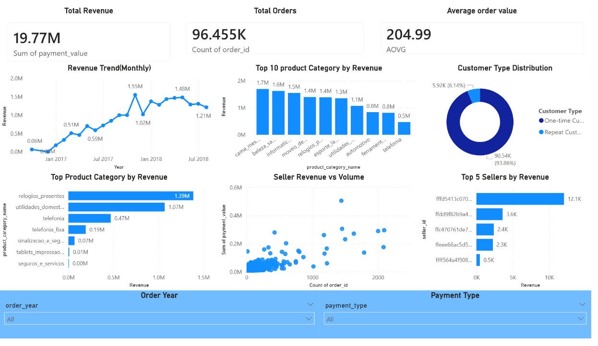

# 📦 Olist E-Commerce Performance Analysis

**SQL & Power BI Business Intelligence Project**

---

## 📌 Business Problem

E-commerce platforms generate large volumes of transactional data, but without proper analysis, it becomes difficult to understand performance, customer behavior, and revenue drivers.

This project analyzes the **Olist Brazilian E-commerce dataset** to identify key factors influencing **revenue growth, customer retention, seller performance, and payment behavior**, enabling data-driven business decisions.

---

## 🎯 Objectives

* Analyze overall business performance using key KPIs
* Identify top revenue-generating product categories
* Understand customer purchasing behavior
* Evaluate seller contribution and revenue concentration
* Analyze payment method trends
* Provide actionable business recommendations

---

## 📂 Dataset

* **Source:** Olist Brazilian E-Commerce Dataset (public dataset)
* **Type:** Relational dataset (multiple tables)

### Key Tables Used:

* `orders`
* `order_items`
* `customers`
* `products`
* `sellers`
* `payments`

> ⚠️ Note: Dataset files are not included due to size constraints.

---

## 🛠 Tools & Technologies

* **SQL (MySQL):** Joins, Aggregations, Subqueries
* **Power BI:** Interactive Dashboard & Visualization
* **Data Modeling:** Star-schema analytical structure
* **Version Control:** Git & GitHub

---

## 🔍 Methodology

1. Imported relational datasets into MySQL
2. Filtered only **delivered orders** to ensure accurate analysis
3. Created a **master dataset** by joining multiple tables
4. Performed SQL analysis to compute KPIs and answer business questions
5. Built an **interactive Power BI dashboard**
6. Derived insights and translated them into business recommendations

---

## 📊 Key Business Questions

* What are total revenue, total orders, and average order value?
* How does revenue trend over time?
* Which product categories drive the most revenue?
* What is the contribution of repeat vs one-time customers?
* Which sellers contribute the most to revenue?
* How concentrated is seller performance?
* What payment methods are most used?

---

## 📈 Key Insights

* The platform generated **~19.77M total revenue** from **~96K delivered orders**
* The **average order value (~205)** indicates consistent customer spending behavior
* Revenue shows a **steady upward trend**, indicating platform growth
* A **small number of product categories contribute disproportionately** to revenue (Pareto effect)
* **Repeat customers drive a significant portion of revenue**, highlighting strong customer retention impact
* Revenue is **highly concentrated among a small group of sellers**, indicating marketplace imbalance
* **Credit cards dominate payment usage**, suggesting customer preference for convenience and flexibility

---

## 📊 Dashboard

The Power BI dashboard provides an **executive-level overview** of:

* Total Revenue, Orders, and Average Order Value
* Monthly Revenue Trends
* Top Product Categories
* Customer Segmentation (Repeat vs One-time)
* Seller Revenue Contribution
* Payment Method Distribution

---

## 💡 Business Recommendations

* Focus marketing strategies on **top-performing product categories**
* Strengthen **customer retention programs** to maximize repeat purchases
* Support **mid-tier sellers** to reduce revenue concentration risk
* Optimize **logistics and delivery performance** in underperforming regions
* Simplify and promote **preferred payment methods** to improve conversion rates

---

## ✅ Outcome

This project transforms raw relational data into a **centralized business intelligence dashboard**, enabling stakeholders to:

* Monitor performance in real-time
* Identify revenue drivers
* Understand customer behavior
* Make data-driven strategic decisions

---

## 🏁 Conclusion

This analysis demonstrates how **SQL and Power BI** can be used together to extract meaningful insights from complex e-commerce data.

A well-structured dashboard can effectively track business health, uncover hidden patterns, and support strategic growth decisions in a competitive e-commerce environment.

